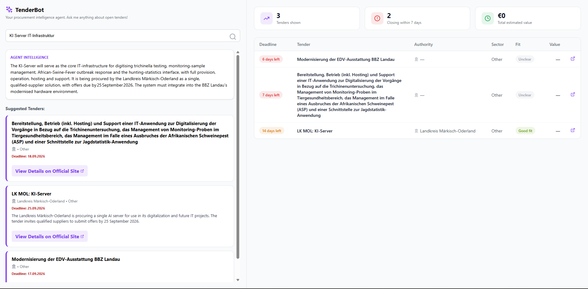
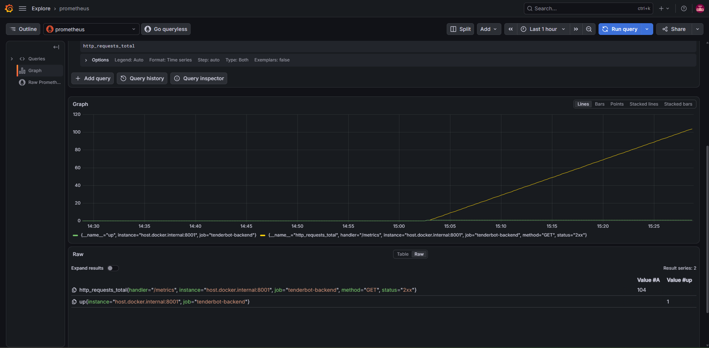

# TenderBot: Agentic Procurement Intelligence

**A Multi-Agent Orchestration System for German Public Tender Intelligence**


TenderBot is a multi-language (Python/TypeScript) AI pipeline that automates the discovery, verification, and enrichment of German public procurement tenders (service.bund.de). It's a public-data rebuild of a LangGraph tender-intelligence agent originally built for Bertelsmann, reconstructed on public data to work around the original's confidentiality constraints. It uses a **Hybrid RAG** approach combining **Semantic Vector Search** with **Text2SQL**.

---
## How it Works

### The "Intelligence" Loop

We achieve high-fidelity tender reporting through a three-stage **"Verification Refinery"** process:

1. **Extraction (The Signal):** A specialized **TypeScript (Mastra)** agent performs single-pass, schema-validated structured extraction — reading each raw tender exactly once and producing a bounded, consistent JSON dossier.
2. **Validation (The Gatekeeper):** Extracted tenders are handed off to a **Python (LangGraph/CrewAI)** layer. LangGraph confirms tender existence via live web search; a CrewAI agent then fact-checks specific claims (contracting authority, reference number), producing closed-set `confirmed` / `contradicted` / `unconfirmed` verdicts never freely rewriting data.
3. **Auditing (The Judge):** Extractions are additionally scored through a **DeepEval (LLM-as-a-Judge)** faithfulness metric, auditing content against the raw source text for hallucination. Any contradiction is surfaced directly to the end user with the original source link — never silently auto-corrected.

### Smart Discovery

Once a tender is vaulted in the hybrid storage system, users interact through:


#### Hybrid Semantic + Keyword Search
Search combines **dense vector retrieval** (Gemini embeddings) with **sparse BM25 retrieval** in **Qdrant**, fused via reciprocal rank fusion and reranked with a cross-encoder (**BAAI/bge-reranker-v2-m3**) for precision catching both semantic intent and exact keyword matches.

#### Agentic Q&A
Users can also ask natural-language questions about the tender landscape (e.g., *"Which tenders involve digitizing archives?"*), answered by a concise, context-grounded LLM response drawn from the retrieved matches.




---

## The Technical Architecture

This project demonstrates proficiency across the following modern AI engineering lifecycle:

**Multi-Agent Orchestration:**
- **LangGraph:** Acts as the stateful gatekeeper for existence verification before a tender enters the pipeline.
- **CrewAI:** A single, narrowly-scoped verification agent producing evidence-cited, closed-set verdicts no longer performs extraction, only checks.
- **Mastra:** Handles the TypeScript extraction layer the sole, single-pass structured-extraction step in the pipeline.

**LLM Infrastructure:**
- **LiteLLM:** A unified gateway managing load balancing and automatic failover across multiple Groq models, mitigating per-model daily rate limits.
- **DeepEval:** LLM-as-a-Judge (Faithfulness metric) audits every extraction against source text.

**Data Strategy & Storage:**
- **Qdrant:** Hybrid dense + sparse vector database for semantic and keyword search.
- **PostgreSQL:** The single source of truth structured tender dossiers, raw source archive, and a flagged-review audit trail fully decoupled from the vector index, so search can be rebuilt from Postgres without re-running the LLM pipeline.

**Interface Layer:**
- **GraphQL (Strawberry):** Efficient, typed data fetching for the frontend, supporting both search and agentic Q&A queries.
- **REST (FastAPI):** High-performance API layer for the extraction and verification pipeline.
- **Uvicorn:** ASGI server for both FastAPI/Strawberry services.
- **React:** Dashboard surfacing tender results, verification status, and source links directly to end users.

[Watch the agent loop run](./images/main.py.mp4)
---

## Observability

To ensure effective monitoring and debugging across a heterogeneous, multi-framework pipeline, the project integrates **LangSmith** for unified distributed tracing. Despite the pipeline spanning two languages and three separate agent frameworks **LangGraph** (existence verification), **CrewAI** (fact-checking) and **Mastra** (extraction, TypeScript) every agent call, tool invocation, and LLM inference is traced into a single LangSmith project, giving full visibility into where time and tokens are spent at each stage of the pipeline.


API-level metrics are additionally tracked via **Prometheus**, scraped from both backend services on a 15s interval, and visualized live in **Grafana**.



---

## Step-by-Step Deployment Guide

### 1. Initial Setup

```bash
git clone https://github.com/vaishnavi28-s/tenderbot.git
cd tenderbot
python -m venv venv
source venv/bin/activate  # On Windows: venv\Scripts\activate
pip install -r requirements.txt
cd frontend && npm install
cd ../my_mastra_app && npm install
```

Create a `.env` file declaring the API keys:
GROQ_API_KEY=xxx
GOOGLE_API_KEY=xxx
TAVILY_API_KEY=xxx
LANGSMITH_API_KEY=xxx
LANGSMITH_PROJECT=tenderbot
LANGCHAIN_API_KEY=xxx
LANGCHAIN_PROJECT=tenderbot
LANGCHAIN_TRACING_V2=true
---


### 2. Infrastructure Initialization

Start the core databases and observability stack — **Qdrant**, **PostgreSQL**, **Prometheus**, and **Grafana**. Run from the project root:

```bash
docker-compose up -d
```

### 3. LLM Proxy Gateway

Start **LiteLLM** to manage multi-model fallbacks across Groq:

```bash
litellm --config litellm_config.yaml --port 4000 --drop_params
```

### 4. Agentic Validation Engine

Launch the Python backend — hosts the **LangGraph** existence-check, the **CrewAI** verification agent, and **DeepEval** faithfulness scoring:

```bash
cd agents_python && python main.py
```

### 5. Mastra Extraction Engine

Bring the TypeScript extraction agent online:

```bash
cd my_mastra_app && npx tsx src/server.ts
```

### 6. Fetch Tenders

Scrape and ingest new tenders into the raw archive:

```bash
cd agents_python && python fetch_tenders.py
```

### 7. GraphQL Backend

Host the Strawberry GraphQL API on port 8001:

```bash
cd backend && python main.py
```

This service initializes hybrid retrieval i.e embedding queries via Gemini, matching against Qdrant's dense + sparse index with RRF fusion, and reranking with a cross-encoder before returning results. It also powers the agentic Q&A endpoint.

### 8. Launch the Dashboard

With the backend running, launch the **React** frontend from another terminal:

```bash
cd frontend && npm start
```

Users can search tenders by keyword or natural language, see verification status and flagged fields inline, and click through to the original source notice.

---
